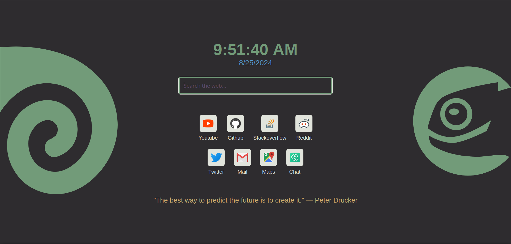

# Leaf-Dark OpenSUSE startpage

My custom firefox startpage for my OpenSUSE Tumbleweed system using the [Leaf-Dark](https://github.com/qewer33/leaf-kde) color palette.

Feel free to fork this repo and tweak the startpage to your needs. 

## Usage

The page is deployed to github pages so you can access it [here](https://jg03dev.github.io/startpage/).

Configure your browser to open this page either on a new window or on a new tab using [tab override](https://addons.mozilla.org/en-US/firefox/addon/new-tab-override/)